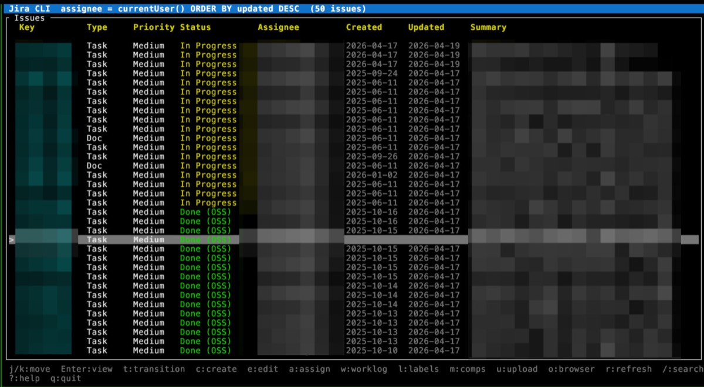

# jirac

A fast, feature-rich Jira CLI built in Rust.

[](https://github.com/mulhamna/jira-commands/actions/workflows/ci.yml)
[](https://crates.io/crates/jira-commands)
[](https://github.com/mulhamna/homebrew-tap)
[](LICENSE)

`jirac` is an opinionated Jira terminal client that fills the gaps left by existing CLIs: **full custom field support** via runtime introspection, **native attachment uploads**, **cursor-based pagination**, and full compatibility with **Jira REST API v3**.

It ships as a single binary with no runtime dependencies, runs on macOS, Linux, and Windows, and includes an interactive TUI, an [MCP server](#mcp-server) for editor/agent integrations, and a [Claude Code plugin](#claude-code-plugin).

## Preview



## Installation

### Homebrew (macOS / Linux)

```bash
brew tap mulhamna/tap && brew install jira-commands
```

### Shell script (macOS / Linux)

```bash
curl -sSL https://raw.githubusercontent.com/mulhamna/jira-commands/main/install.sh | bash
```

### Cargo

```bash
cargo install jira-commands
```

### Pre-built binaries and archives

Download from [GitHub Releases](https://github.com/mulhamna/jira-commands/releases).

For manual installs, prefer the packaged archives. They include the binary plus license files and README.

| Platform              | Raw binary                 | Preferred archive            |
| --------------------- | -------------------------- | ---------------------------- |
| macOS (Apple Silicon) | `jirac-macos-aarch64`      | `jirac-macos-aarch64.tar.gz` |
| macOS (Intel)         | `jirac-macos-x86_64`       | `jirac-macos-x86_64.tar.gz`  |
| Linux (x86_64)        | `jirac-linux-x86_64`       | `jirac-linux-x86_64.tar.gz`  |
| Linux (ARM64)         | `jirac-linux-aarch64`      | `jirac-linux-aarch64.tar.gz` |
| Windows (x86_64)      | `jirac-windows-x86_64.exe` | `jirac-windows-x86_64.zip`   |

## Quick start

### 1. Create an API token

Go to [Atlassian API tokens](https://id.atlassian.com/manage-profile/security/api-tokens) and create a new token.

### 2. Authenticate

```bash
jirac auth login
```

You will be prompted for your Jira base URL, email, and API token. Credentials are stored in `~/.config/jira/config.toml` with `600` permissions.

### 3. Start using it

```bash
jirac issue list                          # your assigned issues
jirac issue list -p PROJ                  # issues in a project
jirac issue view PROJ-123                 # view issue detail
jirac issue create -p PROJ                # create (interactive)
jirac issue transition PROJ-123 --to Done # transition
jirac tui -p PROJ                         # interactive TUI
```

## Usage

### Issues

```bash
jirac issue list                                    # assigned to you
jirac issue list -p PROJ                            # by project
jirac issue list --jql "status = 'In Progress'"     # custom JQL

jirac issue view PROJ-123                           # view detail
jirac issue create -p PROJ                          # create (interactive)
jirac issue create -p PROJ --type Bug --summary "Login fails on Safari"

jirac issue update PROJ-123 --summary "New title"
jirac issue update PROJ-123 --assignee user@co.com

jirac issue transition PROJ-123                     # interactive picker
jirac issue transition PROJ-123 --to "In Progress"

jirac issue attach PROJ-123 ./screenshot.png
jirac issue delete PROJ-123
```

### Worklogs

```bash
jirac issue worklog list PROJ-123
jirac issue worklog add PROJ-123 --time 2h --comment "Fixed auth bug"
jirac issue worklog delete PROJ-123 --id 10234
```

### Bulk operations

```bash
jirac issue bulk-transition -p PROJ -q 'status = "To Do"' -t "In Progress"
jirac issue bulk-update -p PROJ -q 'status = Done' --field assignee --value me@co.com
jirac issue archive -p PROJ -q 'status = Done AND updated < -90d'
```

### JQL builder

```bash
jirac issue jql                                     # interactive
```

### Raw API passthrough

```bash
jirac api get /rest/api/3/serverInfo
jirac api post /rest/api/3/issue --body '{"fields":{...}}'
```

### Plans (Jira Premium)

```bash
jirac plan list
```

### Auth management

```bash
jirac auth login
jirac auth status
jirac auth update --token NEW_TOKEN
jirac auth update --url https://new.atlassian.net
jirac auth logout
```

## Interactive TUI

```bash
jirac tui                      # your assigned issues
jirac tui -p PROJ              # specific project
```

| Key         | Action                  |
| ----------- | ----------------------- |
| `j` / `k`   | Navigate up / down      |
| `Enter`     | View issue              |
| `c`         | Create issue            |
| `e`         | Edit issue              |
| `a`         | Assign issue            |
| `t`         | Transition issue        |
| `w`         | Add worklog             |
| `l`         | Manage labels           |
| `m`         | Manage components       |
| `u`         | Upload attachment       |
| `o`         | Open in browser         |
| `r`         | Refresh                 |
| `/`         | JQL search              |
| `?`         | Help                    |
| `q` / `Esc` | Quit / back             |

## Configuration

Config file: `~/.config/jira/config.toml`

```toml
base_url = "https://yourcompany.atlassian.net"
email = "you@example.com"
token = "your_api_token"
project = "PROJ"           # optional default project
timeout_secs = 30
```

Environment variables override the config file:

```bash
export JIRA_URL=https://yourcompany.atlassian.net
export JIRA_EMAIL=you@example.com
export JIRA_TOKEN=your_api_token
```

## MCP server

`jirac-mcp` exposes Jira as typed [Model Context Protocol](https://modelcontextprotocol.io) tools for editors, agents, and desktop apps.

### Install

```bash
cargo install jira-mcp
```

Or via the install script, which downloads the correct packaged release for your platform:

```bash
curl -sSL https://raw.githubusercontent.com/mulhamna/jira-commands/main/install.sh | BINARY=jirac-mcp bash
```

### Run

```bash
# stdio (local MCP clients)
jirac-mcp serve --transport stdio

# Streamable HTTP (remote clients)
jirac-mcp serve --transport streamable-http --host 127.0.0.1 --port 8787 --path /mcp
```

### Client configuration

```json
{
  "mcpServers": {
    "jira": {
      "command": "jirac-mcp",
      "args": ["serve", "--transport", "stdio"]
    }
  }
}
```

### Available tools

| Category | Tools |
|---|---|
| Auth | `jira_auth_status`, `jira_auth_set_credentials`, `jira_auth_logout` |
| Issues | `jira_issue_list`, `jira_issue_view`, `jira_issue_create`, `jira_issue_update`, `jira_issue_delete` |
| Metadata | `jira_issue_types_list`, `jira_issue_fields`, `jira_issue_transitions_list` |
| Workflow | `jira_issue_transition`, `jira_issue_attach`, `jira_worklog_list`, `jira_worklog_add`, `jira_worklog_delete` |
| Bulk | `jira_issue_bulk_transition`, `jira_issue_bulk_update`, `jira_issue_archive` |
| Advanced | `jira_plan_list`, `jira_api_request` |

Destructive tools (delete, archive, bulk operations) require `confirm: true`. The `jira_api_request` tool provides raw access to any Jira REST endpoint.

## Claude Code plugin

```bash
# 1. Install the CLI (the plugin calls this binary)
cargo install jira-commands
jirac auth login
```

The plugin namespace remains `/jira:*`, but the CLI binary it invokes is `jirac`.

```
# 2. In Claude Code
/plugin marketplace add mulhamna/jira-commands
/plugin install jira@jira-commands
```

| Skill                   | Description                         |
| ----------------------- | ----------------------------------- |
| `/jira:list-issues`     | List issues by project or JQL       |
| `/jira:view-issue`      | View full issue detail              |
| `/jira:create-issue`    | Create a new issue                  |
| `/jira:update-issue`    | Update an existing issue            |
| `/jira:transition`      | Transition an issue                 |
| `/jira:comment`         | List comments or add a Markdown comment |
| `/jira:worklog`         | List, add, or delete worklogs       |
| `/jira:fields`          | Inspect available field metadata    |
| `/jira:bulk-transition` | Bulk transition issues via JQL      |
| `/jira:attach`          | Upload a file to an issue           |
| `/jira:jql`             | Build and run a JQL query           |
| `/jira:api`             | Raw REST API passthrough            |

## Using jira-core as a library

The `jira-core` crate can be used independently as a Rust library:

```toml
[dependencies]
jira-core = "0.10"
```

```rust
use jira_core::{JiraClient, config::JiraConfig};

#[tokio::main]
async fn main() -> anyhow::Result<()> {
    let config = JiraConfig::load()?;
    let client = JiraClient::new(config);

    let results = client.search_issues("project = PROJ", None, Some(10)).await?;
    for issue in results.issues {
        println!("{}: {}", issue.key, issue.summary);
    }
    Ok(())
}
```

See [jira-core on crates.io](https://crates.io/crates/jira-core) for full API documentation.

## Building from source

```bash
git clone https://github.com/mulhamna/jira-commands
cd jira-commands
cargo build --all
cargo test --all
```

### Workspace layout

```
crates/
├── jira-core/     # Rust library — API client, auth, models, ADF parser
├── jira/          # CLI binary (jirac) — clap commands + ratatui TUI
└── jira-mcp/      # MCP server binary (jirac-mcp) — rmcp-based
plugin/
└── .claude-plugin/  # Claude Code plugin (9 skills)
```

Releases are automated via [release-please](https://github.com/googleapis/release-please). See [CHANGELOG.md](CHANGELOG.md) for version history.

## Upgrading from `jira` to `jirac`

The binary was renamed from `jira` to `jirac` in v0.7.0. The legacy `jira` binary is still included in every release with a deprecation warning, and will be removed in a future major release.

```bash
# Update aliases if needed
alias jira='jirac'
```

Homebrew users: `brew upgrade jira-commands` handles the transition automatically.

## License

[MIT](LICENSE)

---

<sub>**jirac** is an independent, community-built tool. It is not affiliated with, endorsed by, or sponsored by Atlassian. "Jira" is a trademark of Atlassian.</sub>
