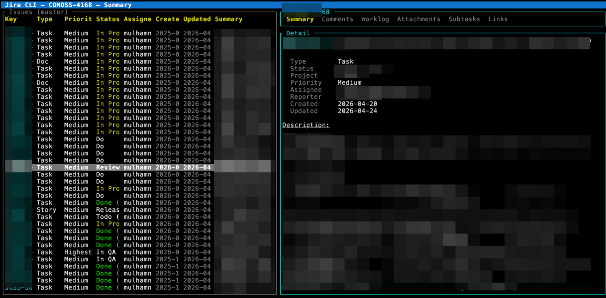

# jirac

Jira on the command line.

[](https://github.com/mulhamna/jira-commands/actions/workflows/ci.yml)
[](https://crates.io/crates/jira-commands)
[](https://github.com/mulhamna/homebrew-tap)
[](LICENSE-MIT)

`jirac` is a Jira command-line client written in Rust. It ships as a single binary with no runtime dependencies and runs on macOS, Linux, and Windows. It supports Jira Cloud and Jira Data Center, stores multiple login profiles, and discovers custom fields at runtime so there is little to configure beyond your credentials.




## Highlights

- **Interactive TUI** — browse, search, create, edit, change type, move between projects, transition, assign, comment, worklog, upload, and inspect issues without leaving the terminal
- **Split master-detail UI** — keep the issue list visible while opening summary, comments, worklog, attachments, subtasks, and links
- **Saved query and theme preferences** — reuse saved JQLs, persist visible columns, and switch TUI themes
- **Multi-profile auth** — store and switch between multiple Jira accounts or deployments
- **Custom fields** — discovered at runtime via the API, not hardcoded
- **Attachments** — upload files to any issue from the CLI
- **Worklogs** — add, list, and delete time entries
- **Bulk operations** — transition, update, archive, or create many issues from JQL or JSON manifests
- **JQL builder** — interactive prompt that helps you construct queries
- **Raw API passthrough** — call any Jira REST endpoint directly
- **MCP server** — expose Jira as typed tools for editors and AI agents ([docs](crates/jira-mcp/README.md))

## Comparison

| Feature                           |      **jirac**      | [jira-cli](https://github.com/ankitpokhrel/jira-cli) (Go) | [jira-cmd](https://github.com/palashkulsh/jira-cmd) (Node) |
| --------------------------------- | :-----------------: | :-------------------------------------------------------: | :--------------------------------------------------------: |
| Single binary, no runtime deps    |          ✅          |                             ✅                             |                          ❌ (npm)                           |
| Interactive TUI                   |          ✅          |                             ✅                             |                             ❌                              |
| Jira REST API version             |       v2 / v3       |                          v2 / v3                          |                             v2                             |
| Custom fields (runtime discovery) |          ✅          |                  Partial (config-based)                   |                    Partial (field IDs)                     |
| Attachment upload                 |          ✅          |                             ❌                             |                             ❌                              |
| Worklogs (add / list / delete)    |          ✅          |                             ❌                             |                      Add / list only                       |
| Bulk transition                   |          ✅          |                             ❌                             |                             ❌                              |
| Bulk update                       |          ✅          |                             ❌                             |                             ❌                              |
| Bulk create / batch manifests     |          ✅          |                             ❌                             |                             ❌                              |
| Issue archive                     |          ✅          |                             ❌                             |                             ❌                              |
| JQL builder (interactive)         |          ✅          |                             ❌                             |                             ❌                              |
| Raw API passthrough               |          ✅          |                             ❌                             |                             ❌                              |
| Cursor-based pagination           |          ✅          |                        ❌ (offset)                         |                         ❌ (offset)                         |
| MCP server                        |          ✅          |                             ❌                             |                             ❌                              |
| Scoop                             |          ✅          |                             ❌                             |                             ❌                              |
| Multi login / saved profiles      |          ✅          |                             ❌                             |                             ❌                              |
| macOS / Linux / Windows           |      ✅ / ✅ / ✅      |                      ✅ / ✅ / Partial                      |                         ✅ / ✅ / ✅                          |
| Jira Data Center / self-managed   | Cloud + Data Center |                   Cloud + self-managed                    |                    Cloud + self-managed                    |

## Install

```bash
# Homebrew (macOS / Linux)
brew tap mulhamna/tap
brew install jira-commands

# Optional MCP server
brew install jira-mcp

# Cargo
cargo install jira-commands

# Windows (Scoop)
scoop bucket add mulhamna https://github.com/mulhamna/scoop-bucket
scoop install mulhamna/jirac

# Windows (winget)
winget install mulhamna.jirac

# Windows (Chocolatey)
choco install jirac
```

More methods (install script, PowerShell, GitHub Releases): [INSTALL.md](INSTALL.md)

## Quick start

```bash
# Authenticate
jirac auth login

# List your assigned issues
jirac issue list

# View an issue
jirac issue view PROJ-123

# Create an issue (interactive)
jirac issue create -p PROJ

# Transition an issue
jirac issue transition PROJ-123 --to "In Progress"

# Launch the TUI
jirac tui -p PROJ
```

## Usage

### Issues

```bash
jirac issue list                                    # assigned to you
jirac issue list -p PROJ                            # by project
jirac issue list --jql "status = 'In Progress'"     # custom JQL

jirac issue view PROJ-123                           # view detail
jirac issue create -p PROJ                          # create (interactive)
jirac issue create -p PROJ --type Bug --summary "Login fails on Safari"
jirac issue render --input desc.md                  # preview Markdown -> ADF JSON
jirac issue render --input desc.md --output text    # preview rendered plain text

jirac issue update PROJ-123 --summary "New title"
jirac issue update PROJ-123 --assignee user@co.com

jirac issue transition PROJ-123                     # interactive picker
jirac issue transition PROJ-123 --to "In Progress"

jirac issue attach PROJ-123 ./screenshot.png
jirac issue delete PROJ-123
jirac issue change-type PROJ-123 Story
jirac issue move PROJ-123 OTHER
jirac issue clone PROJ-123
jirac issue batch --manifest ops.json
jirac issue bulk-create --manifest issues.json
```

### Worklogs

```bash
jirac issue worklog list PROJ-123
jirac issue worklog add PROJ-123 --time 2h --comment "Fixed auth bug"
jirac issue worklog delete PROJ-123 --id 10234
```

### Bulk operations

```bash
jirac issue bulk-transition -p PROJ -q 'status = "To Do"' -t "In Progress"
jirac issue bulk-update -p PROJ -q 'status = Done' --field assignee --value me@co.com
jirac issue archive -p PROJ -q 'status = Done AND updated < -90d'
jirac issue bulk-create --manifest issues.json
jirac issue batch --manifest ops.json
```

### JQL builder

```bash
jirac issue jql    # interactive query builder
```

### Raw API passthrough

```bash
jirac api get /rest/api/3/serverInfo
jirac api post /rest/api/3/issue --body '{"fields":{...}}'
```

### Plans (Jira Premium)

```bash
jirac plan list
```

### Auth management

```bash
jirac auth login
jirac auth profiles
jirac auth use work-cloud
jirac auth status
jirac auth update --profile client-dc --token NEW_SECRET
jirac auth logout --profile client-dc
```

### Multi-profile examples

```bash
# Jira Cloud
jirac auth login --profile work-cloud

# Jira Data Center with PAT
jirac auth login --profile client-dc

# Switch active account
jirac auth use client-dc
```

## Interactive TUI

The TUI is a full-screen terminal interface for browsing and managing issues. Recent builds include a split master-detail layout, saved JQL picker, theme picker, server summary, config summary overlays, and in-TUI modals for native issue type changes and project moves. Press `?` inside the TUI for a complete shortcut reference.

```bash
jirac tui -p PROJ
```

Full keybinding reference: [TUI.md](TUI.md)

## Configuration

Config file: `~/.config/jira/config.toml`

```toml
current_profile = "work-cloud"

[profiles.work-cloud]
base_url = "https://yourcompany.atlassian.net"
email = "you@example.com"
token = "your_api_token"
project = "PROJ"
timeout_secs = 30
deployment = "cloud"
auth_type = "cloud_api_token"
api_version = 3

[profiles.client-dc]
base_url = "https://jira.company.internal"
email = "ops-user"
token = "your_pat"
project = "OPS"
timeout_secs = 30
deployment = "data_center"
auth_type = "datacenter_pat"
api_version = 2
```

Environment variables override the active profile:

```bash
export JIRA_PROFILE=work-cloud
export JIRA_URL=https://yourcompany.atlassian.net
export JIRA_EMAIL=you@example.com
export JIRA_TOKEN=your_api_token
```

## MCP server

`jirac-mcp` exposes Jira as typed [Model Context Protocol](https://modelcontextprotocol.io) tools for editors, agents, and desktop apps. See the [jirac-mcp README](crates/jira-mcp/README.md) for setup and available tools.

## Using jira-core as a library

The `jira-core` crate can be used independently:

```toml
[dependencies]
jira-core = "0.12"
```

```rust
use jira_core::{JiraClient, config::JiraConfig};

#[tokio::main]
async fn main() -> anyhow::Result<()> {
    let config = JiraConfig::load()?;
    let client = JiraClient::new(config);

    let results = client.search_issues("project = PROJ", None, Some(10)).await?;
    for issue in results.issues {
        println!("{}: {}", issue.key, issue.summary);
    }
    Ok(())
}
```

See [jira-core on crates.io](https://crates.io/crates/jira-core) for full API documentation.

## Building from source

```bash
git clone https://github.com/mulhamna/jira-commands
cd jira-commands
make build       # or: cargo build --all
make test        # or: cargo test --all
make smoke       # fmt-check + clippy + test + build (CI gate)
make help        # list all targets
```

### Workspace layout

```text
crates/
  jira-core/   # shared client, models, config, auth
  jira/        # CLI app
  jira-mcp/    # MCP server
assets/        # screenshots and images
packaging/     # release/install packaging
```

<!-- contributors:start -->
## Contributors

Thanks to everyone helping shape `jirac`. This footer is refreshed automatically during the release lane.

<p align="left">
_Contributor avatars will appear after the first successful release refresh._
</p>
<!-- contributors:end -->
