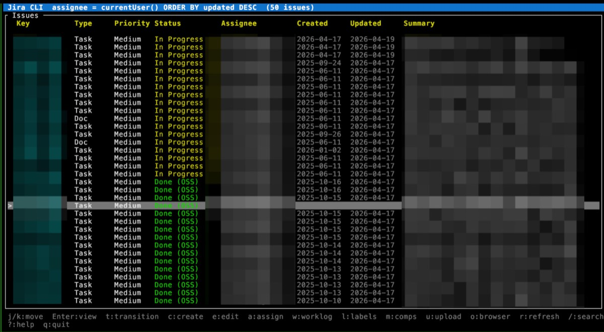
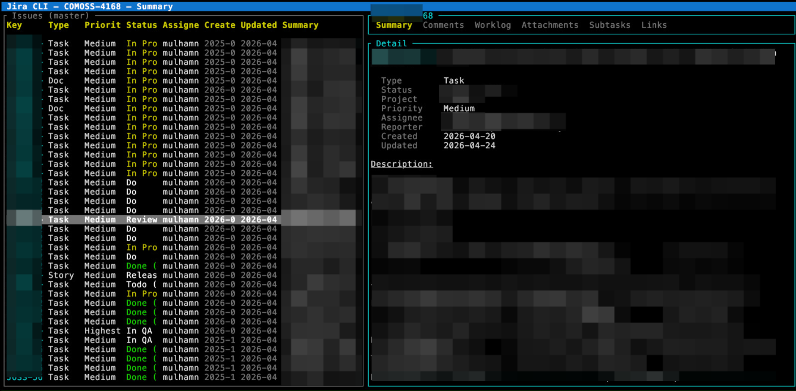
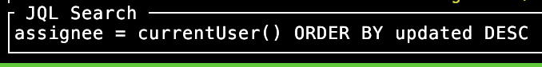

# jirac

Jira on the command line.

[](https://github.com/mulhamna/jira-commands/actions/workflows/ci.yml)
[](https://crates.io/crates/jira-commands)
[](https://www.npmjs.com/package/@mulham28/jirac)

[](https://github.com/mulhamna/homebrew-tap)
[](https://github.com/mulhamna/winget-pkgs/tree/main/manifests/m/mulhamna/jirac)
[](https://community.chocolatey.org/packages/jirac)
[](https://github.com/mulhamna/scoop-bucket)

[](LICENSE-MIT)
[](https://www.bestpractices.dev/projects/12742)
[](http://makeapullrequest.com)

`jirac` is a Jira command-line client written in Rust. It ships as a single binary with no runtime dependencies and runs on macOS, Linux, and Windows. It supports Jira Cloud and Jira Data Center, stores multiple login profiles, and discovers custom fields at runtime so there is little to configure beyond your credentials.

<table>
  <tr>
    <td width="33%" align="center">
      
      <br />
      <sub><strong>TUI issue list</strong></sub>
    </td>
    <td width="33%" align="center">
      
      <br />
      <sub><strong>Split master-detail</strong></sub>
    </td>
    <td width="33%" align="center">
      
      <br />
      <sub><strong>Interactive JQL builder</strong></sub>
    </td>
  </tr>
</table>

## Highlights

- **Interactive TUI** — browse, search, create, edit, change type, move between projects, transition, assign, comment, bulk-comment, worklog, upload, and inspect issues without leaving the terminal
- **Mouse-driven TUI** — click rows, tabs, picker options, and outside-popup; scroll wheel navigates lists; double-click opens detail
- **Split master-detail UI** — keep the issue list visible while opening summary, comments, worklog, attachments, subtasks, and links
- **Saved query and theme preferences** — reuse saved JQLs, persist visible columns, and switch TUI themes (including GitHub Light)
- **Multi-profile auth** — store and switch between multiple Jira accounts or deployments
- **Custom fields** — discovered at runtime via the API, not hardcoded
- **Attachments** — upload files to any issue from the CLI
- **Worklogs** — add, list, and delete time entries
- **Bulk operations** — comment, transition, update, archive, or create many issues from JQL, explicit issue keys, or JSON manifests
- **JQL builder** — interactive prompt that helps you construct queries
- **Raw API passthrough** — call any Jira REST endpoint directly
- **MCP server** — expose Jira as typed tools for editors and AI agents ([docs](crates/jira-mcp/README.md))

## Comparison

| Feature                           |      **jirac**      | [jira-cli](https://github.com/ankitpokhrel/jira-cli) (Go) | [jira-cmd](https://github.com/palashkulsh/jira-cmd) (Node) |
| --------------------------------- | :-----------------: | :-------------------------------------------------------: | :--------------------------------------------------------: |
| Single binary, no runtime deps    |          ✅          |                             ✅                             |                          ❌ (npm)                           |
| Interactive TUI                   |          ✅          |                             ✅                             |                             ❌                              |
| Jira REST API version             |       v2 / v3       |                          v2 / v3                          |                             v2                             |
| Custom fields (runtime discovery) |          ✅          |                  Partial (config-based)                   |                    Partial (field IDs)                     |
| Attachment upload                 |          ✅          |                             ❌                             |                             ❌                              |
| Worklogs (add / list / delete)    |          ✅          |                             ❌                             |                      Add / list only                       |
| Bulk transition                   |          ✅          |                             ❌                             |                             ❌                              |
| Bulk update                       |          ✅          |                             ❌                             |                             ❌                              |
| Bulk create / batch manifests     |          ✅          |                             ❌                             |                             ❌                              |
| Issue archive                     |          ✅          |                             ❌                             |                             ❌                              |
| JQL builder (interactive)         |          ✅          |                             ❌                             |                             ❌                              |
| Raw API passthrough               |          ✅          |                             ❌                             |                             ❌                              |
| Cursor-based pagination           |          ✅          |                        ❌ (offset)                         |                         ❌ (offset)                         |
| MCP server                        |          ✅          |                             ❌                             |                             ❌                              |
| Scoop                             |          ✅          |                             ❌                             |                             ❌                              |
| Multi login / saved profiles      |          ✅          |                             ❌                             |                             ❌                              |
| macOS / Linux / Windows           |      ✅ / ✅ / ✅      |                      ✅ / ✅ / Partial                      |                         ✅ / ✅ / ✅                          |
| Jira Data Center / self-managed   | Cloud + Data Center |                   Cloud + self-managed                    |                    Cloud + self-managed                    |

## Install

```bash
# Homebrew (macOS / Linux)
brew tap mulhamna/tap
brew install jira-commands

# Optional MCP server
brew install jira-mcp

# Cargo
cargo install jira-commands

# Windows (Scoop)
scoop bucket add mulhamna https://github.com/mulhamna/scoop-bucket
scoop install mulhamna/jirac

# Windows (winget)
winget install mulhamna.jirac

# Windows (Chocolatey)
choco install jirac
```

More methods (install script, PowerShell, GitHub Releases): [INSTALL.md](INSTALL.md)
## Quick start

```bash
# Authenticate
jirac auth login

# List your assigned issues
jirac issue list

# View an issue
jirac issue view PROJ-123
jirac issue view PROJ-123 --versions

# Browse or manage project fix versions
jirac issue versions -p PROJ --version "v1.2.0"
jirac issue versions -p PROJ --version "v1.2.0" --set-release-date 2026-05-30 --released
jirac issue versions -p PROJ --create --version "v1.3.0" --description "June release"

# Create an issue (interactive)
jirac issue create -p PROJ

# Transition an issue
jirac issue transition PROJ-123 --to "In Progress"

# Launch the TUI
jirac tui -p PROJ
```

## Usage

### Issues

```bash
jirac issue list                                    # assigned to you
jirac issue list -p PROJ                            # by project
jirac issue list --jql "status = 'In Progress'"     # custom JQL
jirac issue standup                                  # daily standup summary
jirac issue sprint-summary -p PROJ                   # current sprint summary

jirac issue view PROJ-123                           # view detail
jirac issue view PROJ-123 --versions                # include fix-version backlog preview
jirac issue versions -p PROJ                        # list project fix versions
jirac issue versions -p PROJ --version "v1.2.0"    # preview backlog for one fix version
jirac issue versions -p PROJ --version "v1.2.0" --set-start-date 2026-05-20
jirac issue versions -p PROJ --version "v1.2.0" --set-release-date 2026-05-30 --released
jirac issue versions -p PROJ --version "v1.2.0" --set-name "June 2026"
jirac issue versions -p PROJ --create --version "v1.3.0" --description "June release"
jirac issue create -p PROJ                          # create (interactive)
jirac issue create -p PROJ --type Bug --summary "Login fails on Safari"
jirac issue render --input desc.md                  # preview Markdown -> ADF JSON
jirac issue render --input desc.md --output text    # preview rendered plain text

jirac issue update PROJ-123 --summary "New title"
jirac issue update PROJ-123 --assignee user@co.com

jirac issue transition PROJ-123                     # interactive picker
jirac issue transition PROJ-123 --to "In Progress"

jirac issue attach PROJ-123 ./screenshot.png
jirac issue bulk-comment --jql 'project = PROJ AND status = "In Progress"' --body "QA is reviewing this now"
jirac issue bulk-comment --keys PROJ-123 PROJ-456 --file note.md
jirac issue delete PROJ-123
jirac issue change-type PROJ-123 Story
jirac issue move PROJ-123 OTHER
jirac issue clone PROJ-123

jirac issue link list-types                          # list available link types
jirac issue link add PROJ-123 PROJ-456 --type Blocks # link two issues
jirac issue link delete 10000                        # delete link by ID

jirac issue batch --manifest ops.json
jirac issue bulk-create --manifest issues.json
```

### Worklogs

```bash
jirac issue worklog list PROJ-123
jirac issue worklog add PROJ-123 --time 2h --comment "Fixed auth bug"
jirac issue worklog add PROJ-123 --time 2h --date 2026-04-21 --start 09:30 --comment "Backfilled worklog"
jirac issue worklog add PROJ-123 --time 2h --from 2026-04-21 --to 2026-04-25 --exclude-weekends --comment "Backfill week"
jirac issue worklog delete PROJ-123 --id 10234
```

`jirac issue worklog add` also supports optional `--date YYYY-MM-DD` and `--start HH:MM[:SS]` flags to set the Jira worklog `started` timestamp explicitly. For backfills across multiple days, use `--from YYYY-MM-DD --to YYYY-MM-DD`, plus `--exclude-weekends` if Saturdays/Sundays should be skipped. In the TUI, pressing `w` opens the single-worklog modal, while `b` opens a bulk worklog modal for date ranges with weekend exclusion and a submit-confirm step.

### Bulk operations

```bash
jirac issue bulk-comment --jql 'project = PROJ AND sprint = openSprints()' --body 'Please post status before standup'
jirac issue bulk-comment --keys PROJ-123 PROJ-456 --file note.md
jirac issue bulk-transition --jql 'project = PROJ AND status = "To Do"' --to "In Progress"
jirac issue bulk-update --jql 'project = PROJ AND assignee = EMPTY' --assignee me
jirac issue archive --jql 'project = PROJ AND status = Done AND updated < -90d'
jirac issue bulk-create --manifest issues.json
jirac issue batch --manifest ops.json
```

In the TUI, press `:` to open a bulk-comment modal. It supports the current JQL view or an explicit issue-key list, then asks for one more `Ctrl+S` confirmation before posting.

### JQL builder

```bash
jirac issue jql    # interactive query builder
```

### Raw API passthrough

```bash
jirac api get /rest/api/3/serverInfo
jirac api post /rest/api/3/issue --body '{"fields":{...}}'
```

### Plans (Jira Premium)

```bash
jirac plan list
```

### Auth management

```bash
jirac auth login
jirac auth profiles
jirac auth use work-cloud
jirac auth status
jirac auth update --profile client-dc --token NEW_SECRET
jirac auth logout --profile client-dc
```

### Multi-profile examples

```bash
# Jira Cloud
jirac auth login --profile work-cloud

# Jira Data Center with PAT
jirac auth login --profile client-dc

# Switch active account
jirac auth use client-dc
```

## Interactive TUI

The TUI is a full-screen terminal interface for browsing and managing issues. Recent builds include a split master-detail layout, a project-level fix-version browser (`V`) with backlog preview plus in-place version creation (`n`) and metadata editing (`e`), saved JQL picker, theme picker, server summary, config summary overlays, in-TUI modals for native issue type changes and project moves, and both single (`w`) and bulk (`b`) worklog flows. Press `?` inside the TUI for a complete shortcut reference.

The TUI also accepts full mouse input: click any issue row to select, double-click (or click a tab) to open the detail view, click picker options to apply or toggle, scroll the wheel to navigate, and click outside any popup to dismiss it. Form modals stay keyboard-only so in-flight input isn't lost.

```bash
jirac tui -p PROJ
```

Full keybinding and mouse reference: [TUI.md](TUI.md)

## Configuration

Config file: `~/.config/jira/config.toml`

```toml
current_profile = "work-cloud"

[profiles.work-cloud]
base_url = "https://yourcompany.atlassian.net"
email = "you@example.com"
token = "your_api_token"
project = "PROJ"
timeout_secs = 30
deployment = "cloud"
auth_type = "cloud_api_token"
api_version = 3

[profiles.client-dc]
base_url = "https://jira.company.internal"
email = "ops-user"
token = "your_pat"
project = "OPS"
timeout_secs = 30
deployment = "data_center"
auth_type = "datacenter_pat"
api_version = 2
```

Environment variables override the active profile:

```bash
export JIRA_PROFILE=work-cloud
export JIRA_URL=https://yourcompany.atlassian.net
export JIRA_EMAIL=you@example.com
export JIRA_TOKEN=your_api_token
```

## MCP server

`jirac-mcp` exposes Jira as typed [Model Context Protocol](https://modelcontextprotocol.io) tools for editors, agents, and desktop apps. See the [jirac-mcp README](crates/jira-mcp/README.md) for setup and available tools.

### MCP install helpers

Run `jirac mcp install` with no arguments for an interactive picker that first verifies the prerequisites (jirac-mcp binary on PATH, Jira auth configured) and then writes the right config file for the client you pick. Pass `--client <target>` to skip the picker for scripts, or `jirac mcp doctor` to check prerequisites without writing anything.

Supported helpers include Claude Code, Claude Desktop, Cursor, Gemini CLI, Codex, OpenCode, generic JSON snippets, and Zed. Zed uses the official `Jira` marketplace extension from <https://github.com/mulhamna/jirac-ext>, while `jirac mcp install --client zed` seeds `context_servers.jira.settings` in `settings.json`.

See [INSTALL.md](INSTALL.md) for the supported target matrix, client-specific notes, and recommended install flow.

## Using jira-core as a library

The `jira-core` crate can be used independently:

```toml
[dependencies]
jira-core = "0.12"
```

```rust
use jira_core::{JiraClient, config::JiraConfig};

#[tokio::main]
async fn main() -> anyhow::Result<()> {
    let config = JiraConfig::load()?;
    let client = JiraClient::new(config);

    let results = client.search_issues("project = PROJ", None, Some(10)).await?;
    for issue in results.issues {
        println!("{}: {}", issue.key, issue.summary);
    }
    Ok(())
}
```

See [jira-core on crates.io](https://crates.io/crates/jira-core) for full API documentation.

## Building from source

```bash
git clone https://github.com/mulhamna/jira-commands
cd jira-commands
make build       # or: cargo build --all
make test        # or: cargo test --all
make smoke       # fmt-check + clippy + test + build (CI gate)
make help        # list all targets
```

### Workspace layout

```text
crates/
  jira-core/   # shared client, models, config, auth
  jira/        # CLI app
  jira-mcp/    # MCP server
  zed-jira/    # Source-of-truth wrapper code mirrored into github.com/mulhamna/jirac-ext
assets/        # screenshots and images
packaging/     # release/install packaging
```

<!-- contributors:start -->
## Contributors

Thanks to everyone helping shape `jirac`. This footer is refreshed automatically during the release lane.

| <a href="https://github.com/mulhamna" title="@mulhamna"></a> | <a href="https://github.com/apps/github-actions" title="@github-actions[bot]"></a> | <a href="https://github.com/badrus123" title="@badrus123"></a> | <a href="https://github.com/chmdznr" title="@chmdznr"></a> | <a href="https://github.com/EnrikoAviyantoPutra" title="@EnrikoAviyantoPutra"></a> | <a href="https://github.com/apps/dependabot" title="@dependabot[bot]"></a> |
| :-: | :-: | :-: | :-: | :-: | :-: |
| <a href="https://github.com/resincode" title="@resincode"></a> | <a href="https://github.com/ekacahya21" title="@ekacahya21"></a> | <a href="https://github.com/wahyuakbarwibowo" title="@wahyuakbarwibowo"></a> |   |   |   |
<!-- contributors:end -->
